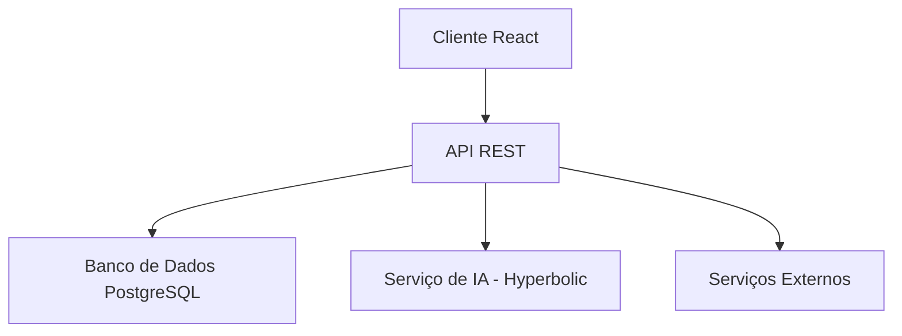

# Stack Técnica - FinAI

## Visão Geral da Arquitetura



## 1. Frontend (React + TypeScript)

### 1.1 Tecnologias Principais
- React 18+
- TypeScript 5+
- Vite (build tool)
- TailwindCSS (estilização)
- React Query (gerenciamento de estado e cache)
- React Router (roteamento)
- Zustand (gerenciamento de estado global)

### 1.2 Estrutura de Diretórios
```
src/
├── assets/          # Imagens, fontes, etc
├── components/      # Componentes React reutilizáveis
│   ├── common/     # Componentes genéricos (botões, inputs, etc)
│   ├── layout/     # Componentes de layout
│   └── features/   # Componentes específicos de features
├── hooks/          # Custom hooks
├── pages/          # Componentes de página
├── services/       # Serviços de API
├── store/          # Gerenciamento de estado global
├── styles/         # Estilos globais
├── types/          # Definições de tipos TypeScript
└── utils/          # Funções utilitárias
```

### 1.3 Exemplo de Componente
```typescript
// src/components/features/TransactionForm.tsx
import React from 'react';
import { useMutation, useQueryClient } from '@tanstack/react-query';
import { createTransaction } from '@/services/transactions';
import { Transaction } from '@/types';

interface TransactionFormProps {
  onSuccess?: () => void;
}

export const TransactionForm: React.FC<TransactionFormProps> = ({ onSuccess }) => {
  const queryClient = useQueryClient();
  const mutation = useMutation({
    mutationFn: createTransaction,
    onSuccess: () => {
      queryClient.invalidateQueries({ queryKey: ['transactions'] });
      onSuccess?.();
    },
  });

  return (
    <form onSubmit={handleSubmit}>
      {/* Form fields */}
    </form>
  );
};
```

## 2. Backend (Node.js + TypeScript)

### 2.1 Tecnologias Principais
- Node.js 20+
- TypeScript 5+
- Express.js
- TypeORM (ORM para PostgreSQL)
- Jest (testes)
- Swagger/OpenAPI (documentação da API)
- Winston (logging)

### 2.2 Estrutura de Diretórios
```
src/
├── config/         # Configurações
├── controllers/    # Controladores da API
├── entities/       # Entidades do TypeORM
├── middlewares/    # Middlewares Express
├── migrations/     # Migrações do banco de dados
├── repositories/   # Repositórios de dados
├── routes/         # Rotas da API
├── services/       # Lógica de negócio
├── types/          # Tipos TypeScript
└── utils/          # Funções utilitárias
```

### 2.3 Exemplo de Entidade
```typescript
// src/entities/Transaction.ts
import {
  Entity,
  Column,
  PrimaryGeneratedColumn,
  CreateDateColumn,
  UpdateDateColumn,
  ManyToOne,
} from 'typeorm';
import { User } from './User';

@Entity('transactions')
export class Transaction {
  @PrimaryGeneratedColumn('uuid')
  id: string;

  @Column('decimal', { precision: 10, scale: 2 })
  amount: number;

  @Column()
  description: string;

  @Column()
  category: string;

  @Column()
  type: 'income' | 'expense';

  @ManyToOne(() => User, user => user.transactions)
  user: User;

  @CreateDateColumn()
  createdAt: Date;

  @UpdateDateColumn()
  updatedAt: Date;
}
```

## 3. Banco de Dados (PostgreSQL)

### 3.1 Esquema do Banco
```sql
-- Usuários
CREATE TABLE users (
    id UUID PRIMARY KEY DEFAULT uuid_generate_v4(),
    email VARCHAR(255) UNIQUE NOT NULL,
    password_hash VARCHAR(255) NOT NULL,
    name VARCHAR(255) NOT NULL,
    monthly_income DECIMAL(10,2),
    created_at TIMESTAMP WITH TIME ZONE DEFAULT CURRENT_TIMESTAMP,
    updated_at TIMESTAMP WITH TIME ZONE DEFAULT CURRENT_TIMESTAMP
);

-- Transações
CREATE TABLE transactions (
    id UUID PRIMARY KEY DEFAULT uuid_generate_v4(),
    user_id UUID REFERENCES users(id),
    amount DECIMAL(10,2) NOT NULL,
    type VARCHAR(10) NOT NULL,
    category VARCHAR(50) NOT NULL,
    description TEXT,
    date TIMESTAMP WITH TIME ZONE DEFAULT CURRENT_TIMESTAMP,
    created_at TIMESTAMP WITH TIME ZONE DEFAULT CURRENT_TIMESTAMP,
    updated_at TIMESTAMP WITH TIME ZONE DEFAULT CURRENT_TIMESTAMP
);

-- Metas Financeiras
CREATE TABLE financial_goals (
    id UUID PRIMARY KEY DEFAULT uuid_generate_v4(),
    user_id UUID REFERENCES users(id),
    title VARCHAR(255) NOT NULL,
    target_amount DECIMAL(10,2) NOT NULL,
    current_amount DECIMAL(10,2) DEFAULT 0,
    deadline DATE,
    status VARCHAR(20) DEFAULT 'active',
    created_at TIMESTAMP WITH TIME ZONE DEFAULT CURRENT_TIMESTAMP,
    updated_at TIMESTAMP WITH TIME ZONE DEFAULT CURRENT_TIMESTAMP
);

-- Categorias
CREATE TABLE categories (
    id UUID PRIMARY KEY DEFAULT uuid_generate_v4(),
    name VARCHAR(50) UNIQUE NOT NULL,
    type VARCHAR(10) NOT NULL,
    icon VARCHAR(50),
    created_at TIMESTAMP WITH TIME ZONE DEFAULT CURRENT_TIMESTAMP
);

-- Análises de IA
CREATE TABLE ai_analyses (
    id UUID PRIMARY KEY DEFAULT uuid_generate_v4(),
    user_id UUID REFERENCES users(id),
    type VARCHAR(50) NOT NULL,
    content JSONB NOT NULL,
    created_at TIMESTAMP WITH TIME ZONE DEFAULT CURRENT_TIMESTAMP
);
```

### 3.2 Índices
```sql
-- Índices para melhor performance
CREATE INDEX idx_transactions_user_id ON transactions(user_id);
CREATE INDEX idx_transactions_date ON transactions(date);
CREATE INDEX idx_financial_goals_user_id ON financial_goals(user_id);
CREATE INDEX idx_ai_analyses_user_id ON ai_analyses(user_id);
```

## 4. Integração com IA (Hyperbolic)

### 4.1 Serviço de IA
```typescript
// src/services/ai.ts
import { HyperbolicClient } from '@hyperbolic/sdk';
import { AIAnalysis } from '@/types';

export class AIService {
  private client: HyperbolicClient;

  constructor() {
    this.client = new HyperbolicClient({
      apiKey: process.env.HYPERBOLIC_API_KEY,
      region: 'us-east-1',
    });
  }

  async analyzeTransactions(userId: string): Promise<AIAnalysis> {
    const transactions = await this.getTransactions(userId);
    
    const analysis = await this.client.inference({
      model: 'financial-analysis-v1',
      input: {
        transactions,
        userProfile: await this.getUserProfile(userId),
      },
    });

    return this.processAnalysis(analysis);
  }
}
```

## 5. API Endpoints

### 5.1 Autenticação
```typescript
POST /api/auth/register
POST /api/auth/login
POST /api/auth/refresh-token
```

### 5.2 Transações
```typescript
GET /api/transactions
POST /api/transactions
PUT /api/transactions/:id
DELETE /api/transactions/:id
```

### 5.3 Análises
```typescript
GET /api/analyses/overview
GET /api/analyses/recommendations
POST /api/analyses/custom
```

## 6. Segurança

### 6.1 Autenticação e Autorização
- JWT para tokens de acesso
- Refresh tokens com rotação
- Rate limiting por IP e usuário
- CORS configurado adequadamente

### 6.2 Proteção de Dados
- Dados sensíveis criptografados
- Prepared statements para queries
- Validação de entrada com Zod
- Headers de segurança (Helmet)

## 7. Monitoramento

### 7.1 Logging
```typescript
// src/utils/logger.ts
import winston from 'winston';

export const logger = winston.createLogger({
  level: 'info',
  format: winston.format.json(),
  transports: [
    new winston.transports.File({ filename: 'error.log', level: 'error' }),
    new winston.transports.File({ filename: 'combined.log' }),
  ],
});
```

### 7.2 Métricas
- Prometheus para métricas
- Grafana para visualização
- Alertas automáticos

## 8. Deployment

### 8.1 CI/CD (GitHub Actions)
```yaml
name: CI/CD

on:
  push:
    branches: [ main ]
  pull_request:
    branches: [ main ]

jobs:
  test:
    runs-on: ubuntu-latest
    steps:
      - uses: actions/checkout@v2
      - name: Setup Node.js
        uses: actions/setup-node@v2
        with:
          node-version: '20'
      - name: Install dependencies
        run: npm ci
      - name: Run tests
        run: npm test

  deploy:
    needs: test
    runs-on: ubuntu-latest
    if: github.ref == 'refs/heads/main'
    steps:
      - name: Deploy to production
        run: |
          # Deploy steps
```

### 8.2 Infraestrutura
- Docker para containerização
- AWS ECS para orquestração
- RDS para PostgreSQL
- CloudFront para CDN